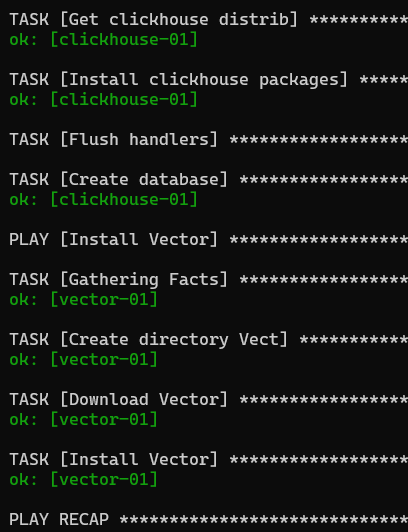

#  Playbook
~~~
 name: Install clickhouse packages
      become: true
      ansible.builtin.yum:
        name:
          - clickhouse-common-static-{{ clickhouse_version }}.rpm
          - clickhouse-client-{{ clickhouse_version }}.rpm
          - clickhouse-server-{{ clickhouse_version }}.rpm
      notify: Start clickhouse service
      tags: clickhouse
~~~

clickhouse - имя пакета установки clickhouse

clickhouse-common-static - переменная для скачивания и установки компонента clickhouse

clickhouse-client - переменная для скачивания и установки компонента clickhouse

clickhouse-server - переменная для скачивания и установки компонента clickhouse

# Описание Play

Получить дистрибутив clickhouse

Install clickhouse

Создание базы clickhouse

Install vector

установлены тэг vector для дальнейшего использования и отладки

создание директории /vect

загрузка установочного пакета .rpm в созданную директорию

установка vector в директорию /vect

